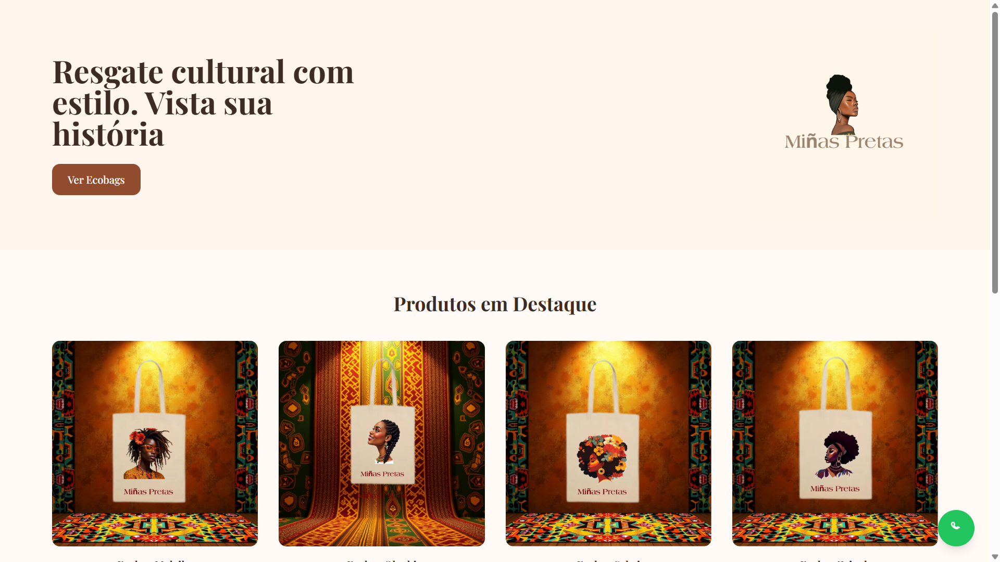
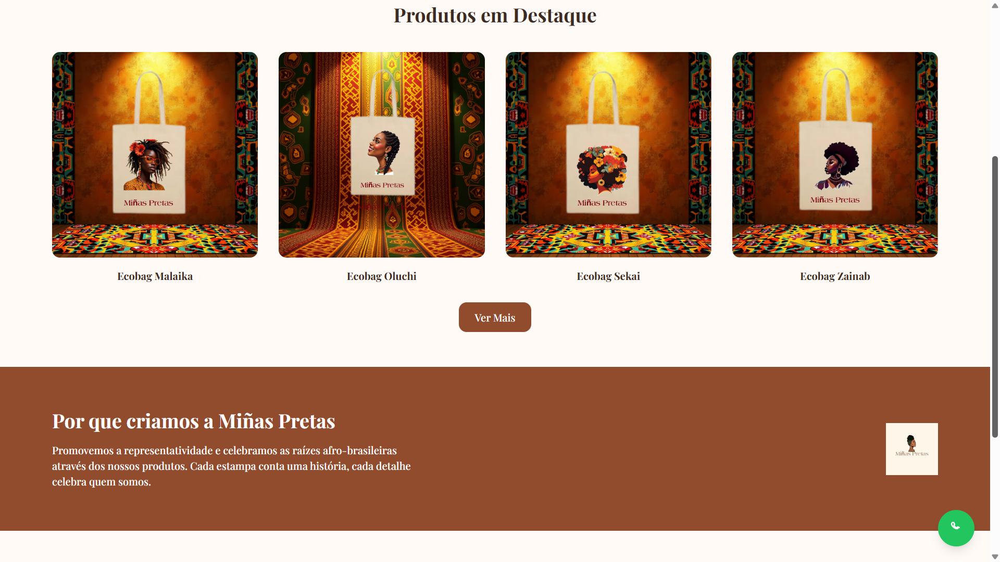
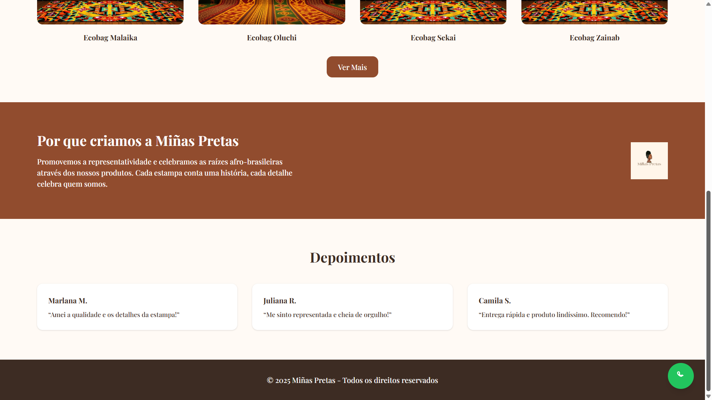
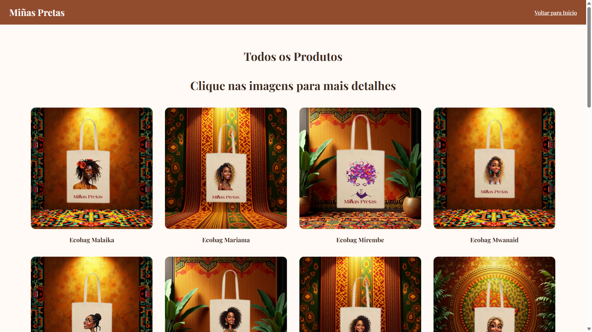

# 👜 Miñas Pretas – E-commerce de Ecobags Afrocentradas

**Miñas Pretas** é um site de apresentação de produtos e vendas diretas via WhatsApp, focado na valorização da cultura afro-brasileira. A proposta é unir representatividade, sustentabilidade e estilo por meio de ecobags artesanais com identidade.

## 🌐 Acesse o site

> 📍 O site está hospedado no [Netlify](https://pages.github.com). 

---

## 📸 Capturas de Tela

| Página Inicial                       | Catálogo de Produtos |
|----------------                      |----------------------|
|    |  |

---

## ⚙️ Tecnologias Utilizadas

- **HTML5** – estrutura semântica moderna
- **CSS3** via **Tailwind CSS** – estilização rápida e responsiva com classes utilitárias
- **JavaScript Vanilla** – interações como modal de detalhes e integração com WhatsApp
- **Google Fonts** – tipografia personalizada com a fonte *Playfair Display*
- **Responsividade Mobile First** – design adaptável a diferentes dispositivos

---

## 🧠 Conceitos Aplicados

- **Componentização visual com Tailwind**: uso de `grid`, `flex`, `gap`, `rounded`, `hover`, etc.
- **Design emocional e identitário**: escolha de cores terrosas (#914c2e, #3d2c23) e tipografia serifada para remeter à elegância e ancestralidade.
- **Integração direta com WhatsApp**: para facilitar a experiência de compra com um clique.
- **Modal interativo com JavaScript**: apresenta mais informações sobre o produto sem sair da página.
- **Organização de código limpo e sem frameworks pesados**: ideal para sites institucionais leves.

---

## 📁 Estrutura de Arquivos

## 📦 Possíveis Evoluções Futuras

- [ ] Adição de carrinho de compras e checkout
- [ ] Backend com Node.js e banco de dados para gerenciamento de produtos
- [ ] Área de administração para cadastro de novos produtos
- [ ] Otimização de SEO para mecanismos de busca
- [ ] Animações com Framer Motion ou Alpine.js

---

## 📲 Contato

Quer encomendar ou colaborar com o projeto?

📧 keilynrosas1@gmail.com  
📱 [WhatsApp: (71) 99727-4453](https://wa.me/5571997274453)

---

## 🪶 Licença

Este projeto é **propriedade exclusiva da marca Miñas Pretas**.  
**É proibido modificar, distribuir ou reutilizar o código e o design sem autorização expressa da autora.**  
Todos os direitos reservados © 2025 – Miñas Pretas.

